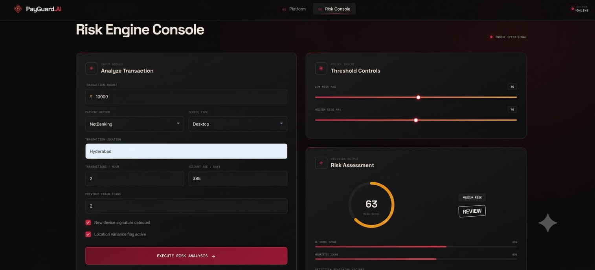
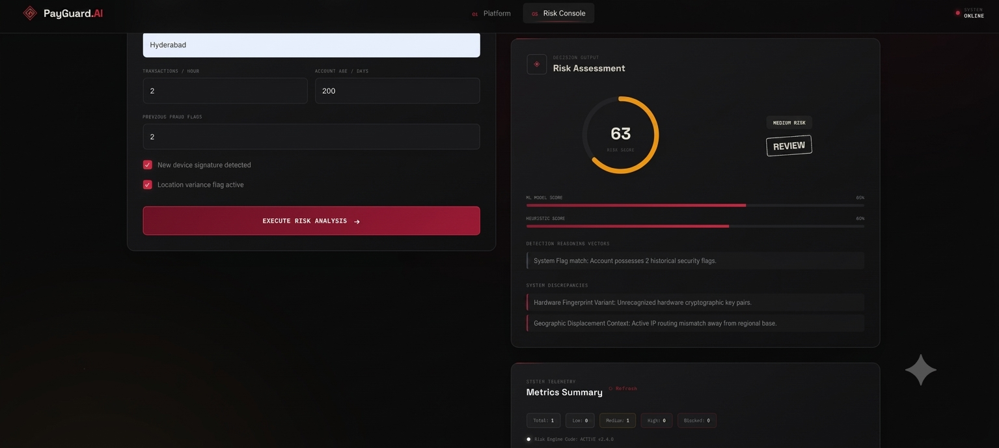
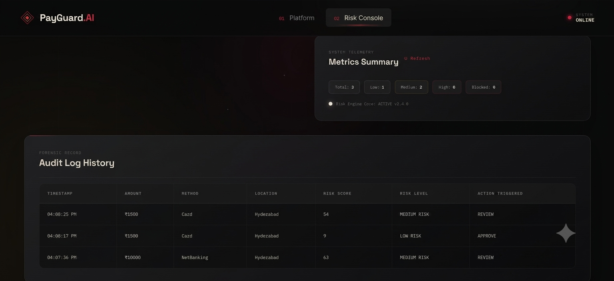

# 🛡️ PayGuard AI

### AI-Powered Transaction Risk Detection & Automated Fraud Assessment

PayGuard AI is an intelligent transaction-risk assessment system that combines **machine learning** with a **transparent rule-based risk engine** to analyze transactions in real time, generate a risk score, explain the reasons behind that score, and recommend an appropriate action.

The system is designed to make fraud-risk decisions more **explainable, measurable, and practical** instead of relying only on a single ML prediction.

---

## 🎯 Problem Statement

Digital payment fraud is becoming increasingly difficult to detect because suspicious transactions can appear similar to legitimate transactions.

A simple fraud classifier may also perform poorly when the dataset is imbalanced, because legitimate transactions usually outnumber fraudulent ones by a large margin.

PayGuard AI addresses this challenge by combining:

- Machine-learning-based fraud probability
- Rule-based transaction risk signals
- Tunable decision thresholds
- Explainable risk indicators
- A real-time web dashboard
- Backend APIs for transaction analysis and history

The goal is to provide a risk decision that is not only predictive, but also understandable.

---

## 💡 Solution

PayGuard AI processes transaction information through an ML model and an independent rule engine.

The two risk components are combined into a final risk score:

```text
Final Risk Score = (ML Score × 0.70) + (Rule Score × 0.30)
```

The resulting score is converted into an actionable decision:

| Risk Score | Risk Level | Decision |
|---:|---|---|
| 0–30 | LOW | ✅ APPROVE |
| 31–70 | MEDIUM | ⚠️ REVIEW |
| 71–100 | HIGH | 🚫 BLOCK |

The application also provides the reasons that contributed to the rule-based risk score, making the final decision easier to understand.

---

## ✨ Key Features

### 🤖 Machine Learning Fraud Detection
- Compares multiple candidate classification models.
- Uses cross-validated **PR-AUC** for model selection.
- Handles class imbalance using balanced class weights.
- Uses a tuned decision threshold instead of blindly relying on 0.5.
- Keeps preprocessing inside the ML pipeline.

### 🔎 Explainable Risk Assessment
- Separates the ML score from the rule score.
- Displays the combined risk score.
- Provides reasons for triggered risk indicators.
- Converts the score into APPROVE, REVIEW, or BLOCK.

### ⚡ Real-Time Transaction Analysis
- FastAPI backend exposes transaction-analysis endpoints.
- Input validation is performed at the API boundary.
- Invalid requests receive structured errors.
- Missing model files are handled without crashing the server.

### 📊 Interactive Dashboard
- Transaction analysis interface
- Risk-score visualization
- Decision badge
- ML-vs-rule score breakdown
- Transaction history
- Analytics
- Loading and error states
- Backend availability indicator

### 🧪 Testing
The project includes automated tests for the risk-engine scenarios.

---

## 🧠 How the AI Works

```text
Transaction Input
       │
       ▼
Input Validation & Preprocessing
       │
       ├─────────────────────┐
       ▼                     ▼
 ML Fraud Model       Rule-Based Engine
       │                     │
       ▼                     ▼
   ML Score              Rule Score
       │                     │
       └──────────┬──────────┘
                  ▼
        Weighted Risk Score
                  │
                  ▼
       Risk Level & Decision
       ┌──────────┼──────────┐
       ▼          ▼          ▼
    APPROVE     REVIEW      BLOCK
                  │
                  ▼
        Explainable Risk Reasons
```

### Model Selection

The training pipeline compares:

- Logistic Regression
- Random Forest
- HistGradientBoosting

The model-selection process uses **cross-validated PR-AUC**, which is more informative than accuracy alone for rare-event fraud classification.

### Data Handling

The preprocessing pipeline:

- Removes identifier fields such as transaction/customer IDs from model features.
- Handles numerical and categorical features.
- Uses `StandardScaler` for numerical preprocessing.
- Uses `OneHotEncoder` for categorical preprocessing.
- Fits preprocessing only on the training data through the pipeline.

### Decision Threshold

Instead of assuming a fixed 0.5 threshold, the training process tunes the threshold using held-out data to improve fraud-class F1 performance.

---

## 🧮 Risk Engine

The risk engine independently calculates:

### 1. ML Score

The trained classification pipeline produces the machine-learning fraud-risk component.

### 2. Rule Score

The rule engine evaluates transaction signals such as:

- Unusually high transaction amount
- New device
- Location change
- High transaction velocity
- New account
- Previous fraud history

### 3. Combined Score

```text
Final Risk Score
= (ML Score × 0.70)
+ (Rule Score × 0.30)
```

### 4. Final Decision

```text
0–30   → LOW    → APPROVE
31–70  → MEDIUM → REVIEW
71–100 → HIGH   → BLOCK
```

This approach combines statistical prediction with understandable transaction-risk signals.

---

## 🏗️ System Architecture

```text
┌───────────────────────────────┐
│        Web Dashboard          │
│      HTML / CSS / JavaScript  │
└───────────────┬───────────────┘
                │ HTTP API
                ▼
┌───────────────────────────────┐
│        FastAPI Backend        │
│  Validation / Analysis / API  │
└───────────────┬───────────────┘
                │
        ┌───────┴────────┐
        ▼                ▼
┌───────────────┐  ┌────────────────┐
│ ML Prediction │  │  Risk Engine   │
│   Pipeline    │  │ Rule Scoring   │
└───────┬───────┘  └───────┬────────┘
        │                  │
        └────────┬─────────┘
                 ▼
        Final Risk Assessment
                 │
                 ▼
       Decision + Explanation
```

---

## 🛠️ Technology Stack

### Frontend
- HTML5
- CSS3
- JavaScript

### Backend
- Python
- FastAPI
- Uvicorn
- Pydantic

### Machine Learning
- Scikit-learn
- Logistic Regression
- Random Forest
- HistGradientBoosting
- StandardScaler
- OneHotEncoder
- ML Pipeline

### Data & Storage
- CSV transaction datasets
- SQLite transaction history

### Testing
- Python `unittest`

### Development
- Git / GitHub
- VS Code
- Python Virtual Environment

---

## 📁 Project Structure

```text
PayGuard-AI/
│
├── backend/
│   └── main.py
│
├── data/
│   ├── generate_dataset.py
│   ├── payguard_ai_transactions.csv
│   ├── cleaned_transactions.csv
│   └── payguard_history.db
│
├── frontend/
│   ├── index.html
│   ├── style.css
│   └── script.js
│
├── ml/
│   ├── __init__.py
│   ├── preprocess.py
│   ├── train_model.py
│   ├── risk_engine.py
│   ├── fraud_model.pkl
│   └── model_metrics.json
│
├── tests/
│   ├── __init__.py
│   └── test_risk_engine.py
│
├── requirements.txt
└── README.md
```

---

## 📊 Model Performance

The current project metrics reported by the training pipeline are:

| Metric | Value |
|---|---:|
| ROC-AUC | 0.79 |
| PR-AUC / Average Precision | 0.41 |
| Test Accuracy | **0.91** |
| Fraud Precision | 0.52 |
| Fraud Recall | 0.39 |
| Fraud F1 | 0.45 |

### Why Accuracy Is Not the Only Metric

Fraud datasets are typically imbalanced. A model can achieve high accuracy simply by predicting the majority class.

Therefore, PayGuard AI considers **PR-AUC, precision, recall, and F1** alongside accuracy when evaluating fraud-detection performance.

> **Note:** These metrics are based on the current synthetic dataset/training run. Performance can change when the model is retrained on different or real-world data.

---

## 🖼️ Screenshots

### Dashboard


### Transaction Risk Analysis and Risk-result





### Transaction History




---

## 🚀 Installation & Setup

### 1. Clone the Repository

```bash
git clone https://github.com/shaik-tabassum/PayGuard-AI.git
cd PayGuard-AI
```

### 2. Create a Virtual Environment

#### Windows

```powershell
python -m venv .venv
.venv\Scripts\activate
```

#### macOS / Linux

```bash
python3 -m venv .venv
source .venv/bin/activate
```

### 3. Install Dependencies

```bash
pip install -r requirements.txt
```

### 4. Train the Model

```bash
python ml/train_model.py
```

This generates/updates the trained model and model metrics.

### 5. Run Tests

```bash
python -m unittest tests.test_risk_engine -v
```

### 6. Start the Backend

From the project root:

```bash
uvicorn backend.main:app --reload
```

Backend:

```text
http://127.0.0.1:8000
```

Swagger API documentation:

```text
http://127.0.0.1:8000/docs
```

### 7. Start the Frontend

You can serve the frontend using:

```bash
python -m http.server 5500 --directory frontend
```

Then open:

```text
http://127.0.0.1:5500
```

The frontend communicates with the FastAPI backend.

---

## 🎥 Demo Video

**5-Minute Pitch and Live Demo**

> Add your final YouTube/Google Drive demo link here.

```text
[Watch the PayGuard AI Demo](YOUR-DEMO-LINK)
```

The recommended demo flow is:

1. Introduce the fraud-detection problem.
2. Explain the PayGuard AI solution.
3. Show the system architecture.
4. Demonstrate a normal transaction.
5. Demonstrate a suspicious/high-risk transaction.
6. Show the ML and rule-score breakdown.
7. Explain the final APPROVE / REVIEW / BLOCK decision.
8. Highlight the project's technical contribution.

---

## 🧪 Testing

The project includes risk-engine tests covering transaction-risk scenarios.

Run:

```bash
python -m unittest tests.test_risk_engine -v
```

Testing focuses on validating the risk assessment and decision logic.

---

## 🔐 Security & Limitations

PayGuard AI is currently designed as a project/demo application.

Before production deployment, the following improvements should be considered:

- Authentication and authorization
- Secure API-key/secret management
- Restricted CORS configuration
- HTTPS/TLS
- Production database configuration
- Model monitoring and drift detection
- Probability calibration
- Additional real-world fraud data
- More extensive security testing

The current wide-open CORS configuration is suitable for local demonstration but should be restricted for production use.

---

## 🔮 Future Scope

Potential future enhancements include:

- Integration with real payment transaction streams
- Real-time fraud monitoring
- Advanced anomaly-detection models
- Model probability calibration
- Continuous model retraining
- Fraud-pattern monitoring and alerts
- Role-based access control
- Secure cloud deployment
- Advanced analytics and reporting
- Explainable AI visualizations
- Model drift and performance monitoring

---

## 🌟 Why PayGuard AI?

PayGuard AI goes beyond a simple **"fraud / not fraud"** prediction.

It combines:

**Machine Learning + Rule-Based Intelligence + Explainability + Real-Time Risk Scoring**

to provide a practical transaction-risk assessment that helps users understand **what the system decided and why**.

---

## 👥 Project

**PayGuard AI**

AI-powered transaction risk detection and automated fraud assessment.

Built as an academic/hackathon project focused on applying machine learning and explainable decision logic to digital transaction security.

---

## 📄 License

This project is intended for academic, demonstration, and hackathon purposes.
